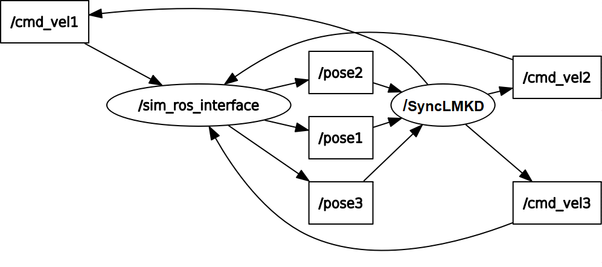
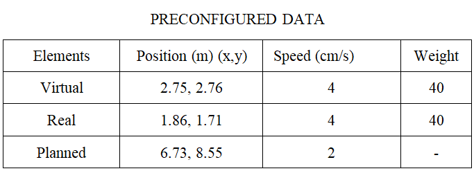
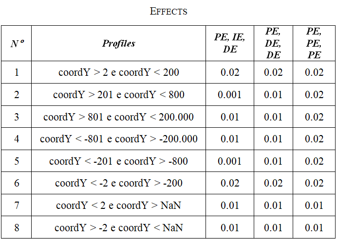

## Configuration of the system used:
Ubuntu 18.04.4 (http://releases.ubuntu.com/18.04.4/)
ROS Melodic (http://wiki.ros.org/melodic/Installation/Ubuntu)

## Step by step:
```
<1 - To run, go to the "CoppeliaSim + ROS" folder,>
<2 - Open the scene "ROBOCAR_ROS_STINGELIN_V18f.ttt" in CoppeliaSim,>
<3 - Copy the work package "controle_posicao_3D",>
<4 - Go to the src folder and rename "stingelin_SBAI.cpp" or "stingelin_ROBOVIS.cpp" to "stingelin.cpp",>
<5 - Execute the “stingelin.cpp” file using the “rosrun” command.>
```

## Instruments:
<table>
  <tr>
    <td align="center">
        <br>
      </a>
    </td>
</table>
The nodes /cmd_vel1, /cmd_vel2 and /cmd_vel3 represent the velocities sent for the displacements of Robot1, Robot2 and Path_Planning. Although the node /cmd_vel3 has been created, no velocity is passed to it. Therefore, the displacement velocity of Path_Planning is provided by the path planning of the BiTRRT algorithm. The nodes /pose1, /pose2 and /pose3 represent, respectively, the odometries of the virtual robot, real robot and idealized path (Path_Planning), all of which are obtained by the main node /SyncLMKD and linked by the message exchange node /sim_ros_interface of the ROS package itself. 

## Parameters:

<table>
  <tr>
    <td align="center">
        <br>
      </a>
    </td>
    <td align="center">
        <br>
      </a>
    </td>
</table>

